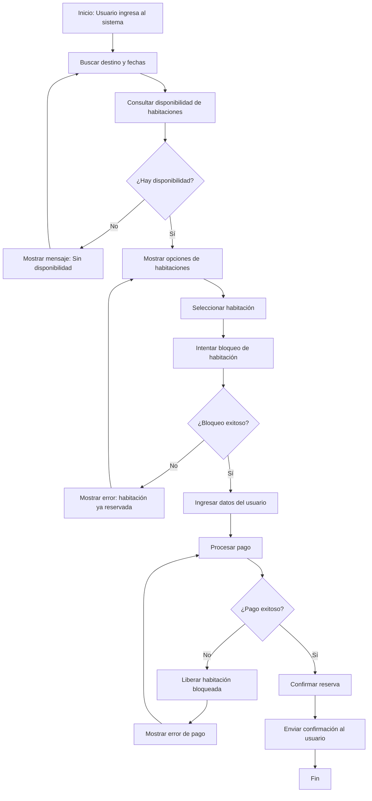

# PRD: 🏨 Travel: Motor de Reservas de Hotel

## 1. Visión

Este MVP implementa un motor de reservas de hotel centrado en la lógica de negocio crítica: verificar disponibilidad en tiempo real, bloquear una habitación específica por 10 minutos durante el check-out y confirmar la reserva solo tras un pago simulado exitoso.

El sistema prioriza la consistencia del inventario con un manejo de concurrencia simple, evitando dobles reservas mediante bloqueo pesimista (transacción + `SELECT ... FOR UPDATE`) y una expiración automática de bloqueos (un estimado de 10 minutos). El frontend (React) expone un flujo de búsqueda → selección → check-out con contador regresivo visible y notificaciones de estado.

El sistema incluye un módulo de administración con autenticación protegida, dashboard operativo, gestión de clientes, gestión de habitaciones y manejo manual de reservas. El usuario invitado cuenta con filtros de búsqueda avanzados y recibe confirmación vía QR y correo electrónico. Los datos iniciales (hotel/habitaciones/tarifas básicas) se cargan vía seeder.

## 2. Alcance (IN/OUT)

### 2.1 Objetivos de negocio

- Reducir el riesgo de sobreventa (double booking) a ~0 en el flujo MVP.
- Incrementar conversión al proteger inventario durante el pago (hold de 10 minutos).
- Liberar automáticamente inventario bloqueado para evitar pérdida de ventas.
- Proveer al administrador visibilidad operativa en tiempo real (métricas, clientes, reservas).
- Mejorar la experiencia post-reserva del viajero con confirmación digital (QR + email).

### 2.2 Objetivos de usuario

- Permitir al viajero seleccionar una habitación y completar el pago con la tranquilidad de que la habitación permanecerá bloqueada durante 10 minutos.
- Dar visibilidad clara del tiempo restante de bloqueo en el check-out.
- Permitir al viajero filtrar habitaciones por ciudad, país y presupuesto.
- Entregar al viajero un código de reserva, QR y correo de confirmación al completar el pago.
- Permitir al administrador del hotel recuperar inventario automáticamente cuando el pago no se completa.
- Proveer al administrador un panel centralizado con métricas, CRUD de clientes, CRUD de habitaciones y gestión de reservas.
- Permitir al administrador verificar reservas mediante código o QR.

### 2.3 Fuera de alcance

- Cancelaciones, cambios de fecha, reembolsos o políticas de penalidad.
- Registro de usuarios viajeros (el viajero opera sin login).
- Multidivisa o integración con pasarelas reales.
- Programas de lealtad.

## 3. Usuarios y roles

### 3.1 Usuarios

- **Viajero (huésped)**: busca una habitación disponible usando filtros de ciudad, país y presupuesto; la bloquea durante el check-out; completa el pago dentro de un límite de tiempo; recibe confirmación con código de reserva, QR y correo electrónico.
- **Administrador del hotel**: gestiona el sistema a través de un panel protegido con credenciales. Tiene acceso a dashboard de métricas, CRUD de clientes, CRUD de habitaciones, módulo de reservas y verificación de reservas por código/QR.

### 3.3 Objetivos de negocio por actor

| Actor | Objetivo cuantificable | Umbral de éxito MVP |
| :--- | :--- | :--- |
| **Viajero** | Completar una reserva desde búsqueda hasta confirmación sin errores del sistema. | ≥ 95 % de flujos completados sin error 5xx ni pérdida de hold. |
| **Viajero** | Recibir correo y QR de confirmación tras el pago. | 100 % de reservas confirmadas generan QR; ≥ 95 % de correos entregados sin rebote. |
| **Administrador** | Mantener el inventario disponible libre de bloqueos fantasma. | 0 % de habitaciones con hold activo más de 11 minutos sin pago registrado (drift < 60 s). |
| **Administrador** | Disponer de visibilidad operativa centralizada al iniciar sesión. | Dashboard carga en < 500 ms con el dataset del MVP (≥ 10 habitaciones, ≥ 50 reservas de prueba). |
| **Administrador** | Verificar la identidad del huésped en check-in físico con QR o código. | 100 % de reservas confirmadas tienen código y QR verificable desde el panel. |
| **Negocio** | Eliminar el riesgo de doble reserva (overbooking). | 0 reservas duplicadas en pruebas de carga con 20 usuarios simultáneos intentando el mismo hold. |
| **Negocio** | Recuperar inventario bloqueado sin intervención manual. | ≥ 99 % de holds expirados liberados dentro de 60 s de su `expires_at`. |

### 3.2 Roles & permissions

- **Viajero (sin login)**: acceso público a búsqueda (con filtros), selección, check-out, pago simulado y confirmación con QR y correo.
- **Administrador del hotel (con login)**: acceso autenticado al panel de administración. Permisos: ver dashboard, gestionar clientes (crear/leer/actualizar/eliminar), gestionar habitaciones (crear/leer/actualizar/eliminar), ver y gestionar reservas (incluida terminación manual), verificar reservas por código o QR.

## 4. Requerimientos funcionales

- **Buscador de disponibilidad atómico** (Priority: P0)
  - Consultar disponibilidad por rango de fechas para habitaciones específicas.
  - La disponibilidad debe descontar:
    - Reservas confirmadas.
    - Bloqueos temporales activos (holds) no expirados.
  - Si una habitación está bloqueada/confirmada para cualquier fecha del rango solicitado, debe aparecer como no disponible para ese rango.

- **Bloqueo pesimista de check-out (10 minutos)** (Priority: P0)
  - Al seleccionar una habitación y rango de fechas, el sistema debe intentar crear un hold.
  - El hold debe crear un “bloqueo temporal” con `expires_at = now() + 10 minutos`.
  - El proceso de creación del hold debe ser atómico y seguro ante concurrencia.
  - En la capa de persistencia, se debe usar transacción y `SELECT ... FOR UPDATE` (o equivalente) para evitar que dos holds/reservas se creen simultáneamente para la misma habitación/rango.

- **Expiración automática de bloqueos** (Priority: P0)
  - Un worker/proceso programado debe liberar holds expirados sin pago.
  - Un hold expirado debe transicionar a un estado final (por ejemplo `EXPIRED`) y dejar la habitación disponible.
  - La expiración debe ser idempotente (ejecutar dos veces no debe romper estados).

- **Pago simulado e idempotente** (Priority: P0)
  - La “pasarela” debe ser mock/simulador con resultado configurable (éxito/fallo).
  - Se deben soportar claves de idempotencia por intento de pago para evitar cobros duplicados (p. ej. reintentos del cliente).
  - Un pago solo puede confirmar una reserva si existe un hold activo y no expirado.
  - Pago fallido debe liberar el hold (o marcarlo como `CANCELLED/RELEASED`) inmediatamente.

- **Confirmación de reserva** (Priority: P0)
  - Tras pago exitoso, se debe crear una reserva confirmada vinculada a la habitación y al rango de fechas.
  - El hold debe transicionar a `CONFIRMED` (o cerrarse) y no volver a liberar inventario.
  - Se debe presentar una pantalla de confirmación (número/código de reserva).

  - **UI con contador regresivo de 10 minutos** (Priority: P0)
  - Al entrar al check-out, el usuario ve el tiempo restante del hold.
  - Al llegar a 0, el flujo debe bloquear el pago y guiar al usuario a reintentar (por ejemplo, volver a seleccionar).
  - La UI debe sincronizar su estado con el backend (no confiar solo en el reloj del cliente).

- **Seeder de datos** (Priority: P1)
  - Carga inicial de hotel(es), habitaciones (por ID único, con ciudad, país e imagen) y tarifas básicas para permitir pruebas end-to-end.
  - Incluir usuario administrador de prueba en el seeder.
  - La creación de datos de prueba no requiere UI.

- **Autenticación de administrador** (Priority: P0)
  - El administrador accede al panel mediante credenciales (email + contraseña).
  - El sistema debe emitir un token JWT firmado con expiración configurable.
  - Todos los endpoints de administración deben estar protegidos por guard de autenticación.
  - No se expone endpoint de registro de administradores (el administrador se crea vía seeder o script CLI).
  - El token debe invalidarse correctamente en logout.

- **Dashboard de administrador** (Priority: P1)
  - Al ingresar, el administrador ve un panel con las siguientes métricas:
    - Top 5 habitaciones más reservadas (nombre, número de reservas confirmadas).
    - Total de ventas realizadas (suma de pagos confirmados, en la moneda base del sistema).
    - Top 5 clientes frecuentes (nombre, número de reservas confirmadas).
  - Los datos deben ser calculados en tiempo real o con caché de corta duración (< 1 minuto).

- **CRUD de clientes (admin)** (Priority: P1)
  - El administrador puede crear, leer, actualizar y eliminar registros de clientes.
  - Campos mínimos del cliente: nombre completo, email, teléfono, documento de identidad.
  - El email debe ser único por cliente.
  - Eliminar un cliente con reservas activas debe estar bloqueado o requerir confirmación explícita.

- **CRUD de habitaciones (admin)** (Priority: P0)
  - El administrador puede crear, leer, actualizar y eliminar habitaciones.
  - Campos ampliados de habitación: nombre/número, tipo, precio por noche, ciudad, país, URL de imagen, descripción, capacidad.
  - La URL de imagen se usa para renderizar una imagen en el listado público de habitaciones.
  - Eliminar una habitación con reservas activas o holds vigentes debe estar bloqueado.

- **Módulo de reservas (admin)** (Priority: P1)
  - El administrador puede ver todas las reservas con filtros por estado, fechas y cliente.
  - El administrador puede dar por terminada manualmente una reserva confirmada: al hacerlo, la reserva pasa a estado `CHECKED_OUT` y la habitación queda disponible.
  - La acción de terminación debe ser irreversible y registrar el `terminated_by` (ID del admin) y `terminated_at` (timestamp).

- **Verificación de reserva (admin)** (Priority: P1)
  - El administrador puede ingresar un código de reserva manualmente y ver el detalle de la reserva asociada.
  - El administrador puede escanear el QR de la reserva y obtener el mismo resultado.
  - La verificación debe mostrar: código, estado, habitación, cliente, fechas, monto pagado.

- **Filtros de búsqueda para invitado** (Priority: P1)
  - El viajero puede filtrar el listado de habitaciones por:
    - Ciudad.
    - País.
    - Presupuesto máximo por noche.
  - Los filtros son acumulables (AND lógico).
  - El listado solo muestra habitaciones disponibles para el rango de fechas seleccionado y que cumplan todos los filtros activos.

- **Código QR en confirmación** (Priority: P1)
  - Al completar el pago exitosamente, la pantalla de confirmación muestra:
    - El código alfanumérico de reserva.
    - Un QR generado en el cliente (o servido por el backend) que codifica el código de reserva.
  - El QR debe ser descargable o imprimible desde la pantalla de confirmación.

- **Correo de confirmación** (Priority: P1)
  - Tras pago exitoso, el sistema envía un correo electrónico al email proporcionado por el viajero durante el check-out.
  - El correo debe incluir: código de reserva, QR (imagen embebida o adjunta), habitación, fechas, monto total.
  - El envío de correo debe ser asíncrono (no bloquea la respuesta del pago).
  - En el MVP se permite un proveedor SMTP simulado o de desarrollo (p. ej. Mailtrap o Nodemailer con transporte de prueba).

## 5. Experiencia de usuario

### 5.1 Flujo principal — Viajero

- Landing con buscador (fechas + filtros: ciudad, país, presupuesto máximo) y listado de habitaciones disponibles con imágenes.
- Selección de una habitación específica inicia el hold y redirige al check-out.
- Check-out muestra datos mínimos, contador y botón "Pagar (simulado)".
- Confirmación muestra código de reserva + QR descargable y dispara envío de correo.

### 5.1b Flujo principal — Administrador

- Login con email y contraseña; redirige al dashboard al autenticarse.
- Dashboard muestra top 5 habitaciones, total de ventas y top 5 clientes frecuentes.
- Navegación lateral a: Clientes, Habitaciones, Reservas, Verificar Reserva.
- En Clientes: tabla con búsqueda, botones crear/editar/eliminar.
- En Habitaciones: tabla con búsqueda, botones crear/editar/eliminar; formulario incluye ciudad, país y URL de imagen.
- En Reservas: tabla con filtros; botón "Dar por terminada" en reservas confirmadas activas.
- En Verificar Reserva: campo de código manual o lector de QR (cámara o upload de imagen).

### 5.2 Nucleo de la experiencia

- **Buscar habitaciones**: el usuario ingresa fecha de entrada/salida y ve habitaciones disponibles.
  - Asegura transparencia al mostrar solo inventario realmente disponible (descuenta holds activos).
- **Seleccionar habitación**: al elegir, el sistema crea un hold de 10 minutos o responde “no disponible”.
  - Asegura consistencia usando bloqueo pesimista ante concurrencia.
- **Check-out con timer**: el usuario completa datos básicos y ve el contador.
  - Asegura claridad del estado temporal del inventario.
- **Pagar (mock)**: el usuario confirma y el backend procesa pago idempotente.
  - Evita cobro/reserva duplicada por reintentos.
- **Confirmación**: se muestra el estado final (confirmado) con código de reserva y QR; se dispara el envío de correo de confirmación al email del viajero.
  - Asegura cierre de transacción de negocio.

### 5.3 Funcionalidades críticas

- Dos usuarios intentan bloquear la misma habitación/rango casi al mismo tiempo.
- Usuario refresca la página durante el hold: la UI debe recuperar el estado del hold.
- Usuario intenta pagar después de que el hold expiró.
- Reintento de pago por timeout de red: se debe aplicar idempotencia.
- Pago fallido: el hold se libera inmediatamente.
- Worker cae temporalmente: los holds expirados deben liberarse al reanudarse el worker (eventual consistency acotada).
- Administrador intenta terminar una reserva ya terminada o cancelada: el sistema debe rechazar la acción.
- Token de administrador expirado: el sistema redirige al login sin exponer información sensible.
- Correo de confirmación falla: el pago y la reserva quedan confirmados; el correo se reintenta de forma asíncrona sin afectar al usuario.

### 5.4 UI/UX

- "Transparencia de disponibilidad": el listado refleja inventario real.
- Listado de habitaciones muestra imagen (desde `image_url`), ciudad, país y precio por noche.
- Filtros de ciudad, país y presupuesto visibles en el buscador público.
- Timer visible con tiempo restante del hold.
- Mensajes claros en "No disponible", "Hold expirado" y "Pago fallido".
- Pantalla de confirmación muestra QR descargable/imprimible y mensaje de que se envió un correo.
- Panel de administración con navegación lateral clara y feedback visual en acciones destructivas (confirmación antes de eliminar).

### 5.5 Flujo de Reserva de Hotel (Usuario Viajero)

## 6. Narrativa

El viajero busca fechas con filtros de ciudad, país y presupuesto, elige una habitación específica con imagen visible, y al seleccionarla el sistema la bloquea durante 10 minutos. Si el pago simulado se confirma dentro del tiempo, la reserva queda confirmada; el viajero recibe su código de reserva con QR en pantalla y por correo electrónico. El administrador, autenticado en su panel, dispone de métricas operativas en tiempo real, gestiona clientes y habitaciones, y puede verificar reservas ingresando el código o escaneando el QR. Si el pago no se completa, el sistema libera la habitación automáticamente manteniendo el inventario siempre vendible.

---

## 7. Riesgos y Mitigaciones

### 7.1 Riesgos Técnicos

| Riesgo | Impacto | Estrategia de Mitigación |
| :--- | :--- | :--- |
| Dos usuarios bloquean la misma habitación al mismo milisegundo. | Crítico | Uso de transacciones de base de datos con **Bloqueo Pesimista** (`SELECT ... FOR UPDATE`). Esto asegura que solo un hilo de ejecución pueda leer y marcar la habitación como bloqueada a la vez. |
| Desincronización entre el contador del Frontend (React) y el tiempo real del servidor. | Medio | El Frontend no debe calcular el fin del tiempo de forma aislada. Debe recibir el `expires_at` del servidor y sincronizarse mediante peticiones periódicas de estado. El servidor tiene la última palabra. |
| El proceso que libera habitaciones cae, dejando inventario bloqueado indefinidamente. | Alto | Implementar el Worker como un proceso independiente e **idempotente**. Además, la lógica de búsqueda de disponibilidad debe filtrar proactivamente bloqueos cuya fecha actual sea mayor a su `expires_at`, incluso si el worker no los ha marcado como expirados aún. |
| El pago tarda más de lo esperado y el bloqueo expira mientras se procesa. | Alto | Implementar un estado intermedio `PROCESSING_PAYMENT`. Mientras la pasarela responda, el bloqueo no debe expirar. Si el pago entra después de la expiración, el sistema debe realizar un "reintegro simulado" automático. |
| El usuario hace clic varias veces o hay un reintento de red. | Crítico | Implementación obligatoria de **Idempotency-Keys** en los headers de la petición. El backend debe registrar cada intento de pago y rechazar duplicados para el mismo ID de bloqueo. |

### 7.2 Riesgos de Negocio

| # | Riesgo | Probabilidad | Impacto | Exposición (P×I) | Estrategia de Mitigación |
| :--- | :--- | :---: | :---: | :---: | :--- |
| RN-01 | Usuarios o bots bloquean todas las habitaciones sin intención de pagar (inventory squatting). | Alta | Crítico | **Alta** | Rate Limiting por IP en `POST /holds` (máx. 2 holds activos por sesión). Tiempo de hold máximo de 10 min libera inventario automáticamente. |
| RN-02 | El timer de 10 minutos genera ansiedad y el usuario abandona la compra (checkout abandonment). | Media | Alto | **Media** | Contador informativo no intrusivo. Mensajes de re-aseguramiento visibles. Prueba A/B de copy en MVP si el abandono supera el 40 %. |
| RN-03 | El usuario cierra la pestaña y la habitación queda bloqueada 10 min innecesariamente (stale hold). | Alta | Medio | **Media** | Evento `onBeforeUnload` dispara `DELETE /holds/:id`. El worker libera holds expirados como fallback. |
| RN-04 | Credenciales de administrador comprometidas dan acceso total al panel (account takeover). | Baja | Crítico | **Media** | JWT con expiración de 8 h, HTTPS obligatorio, rate limiting en `/auth/login` (máx. 5 intentos / 15 min / IP). Sin endpoint de registro público. |
| RN-05 | Correos de confirmación van a spam o fallan silenciosamente (delivery failure). | Media | Medio | **Baja-Media** | Proveedor SMTP con SPF/DKIM en producción. Reintentos asíncronos (hasta 3). Log de fallos. El flujo de reserva no se bloquea si el correo falla. |
| RN-06 | Administrador da por terminada manualmente una reserva activa por error (accidental checkout). | Baja | Medio | **Baja** | Modal de confirmación obligatorio antes de ejecutar. Registro de `terminated_by` y `terminated_at` para auditoría. Acción irreversible solo tras confirmar. |

---

## 8. Métricas de Éxito del MVP

### 8.1 Métricas de negocio (cuantificables)

| Métrica | Definición | Umbral de éxito MVP | Cómo medirlo |
| :--- | :--- | :---: | :--- |
| **Tasa de doble-booking** | Reservas confirmadas duplicadas para la misma habitación y rango de fechas. | **0 casos** en pruebas de carga con 20 usuarios simultáneos. | Test de carga con k6 / Locust; consulta SQL de duplicados post-test. |
| **Tasa de conversión hold→reserva** | Reservas confirmadas / holds creados (excluye holds expirados por inactividad). | **≥ 60 %** en condiciones normales de prueba. | Query: `COUNT(reservations WHERE status=CONFIRMED) / COUNT(holds)`. |
| **Recuperación de inventario** | Holds expirados liberados automáticamente / total holds expirados. | **≥ 99 %** dentro de los 60 s posteriores a `expires_at`. | Monitoreo de worker: timestamp de liberación vs. `expires_at`. |
| **Tasa de entrega de correos** | Correos de confirmación entregados sin rebote / total reservas confirmadas. | **≥ 95 %** en entorno de prueba (Mailtrap). | Log del servicio de mail; conteo de eventos `delivered` vs. `bounced`. |
| **Cobertura QR verificable** | Reservas confirmadas con QR escaneable y coincidente en panel admin / total reservas confirmadas. | **100 %** | Test E2E: generar reserva → escanear QR → verificar código en admin. |
| **Disponibilidad de inventario admin** | Habitaciones con hold activo > 11 min sin pago registrado / total habitaciones del hotel. | **0 %** (drift < 60 s garantizado por worker). | Consulta periódica: `holds WHERE expires_at < NOW() AND status = ACTIVE`. |

### 8.2 Métricas de usuario

| Métrica | Definición | Umbral de éxito MVP |
| :--- | :--- | :---: |
| **Tasa de éxito del flujo completo** | Flujos búsqueda → confirmación completados sin error 5xx ni pérdida de hold. | **≥ 95 %** |
| **Tiempo medio de conversión** | Tiempo promedio entre creación del hold y confirmación del pago. | **< 8 minutos** (dentro del hold de 10 min). |
| **Abandono en check-out** | Holds creados que expiran sin completar pago / total holds creados. | **< 40 %** |

### 8.3 Métricas técnicas

| Métrica | Umbral MVP |
| :--- | :---: |
| p95 `GET /availability` | < 300 ms |
| p95 `POST /holds` | < 500 ms |
| p95 `POST /payments` | < 500 ms |
| p95 `GET /admin/dashboard` | < 500 ms |
| Tasa de conflictos de concurrencia (holds fallidos por colisión) | < 5 % bajo 20 usuarios simultáneos |
| Drift de expiración (`expires_at` → liberación efectiva) | < 60 s |

## 9. Arquitectura de datos

### 9.1 Ecosistema de datos

- React (frontend) consume Nest JS (backend) vía JSON/HTTP.
- Backend persiste estado en base de datos relacional (recomendado: PostgreSQL por soporte robusto de locks).
- Worker de expiración ejecuta tareas periódicas contra la misma base de datos.

### 9.2 Modelo de datos

- Entidades mínimas sugeridas:
  - `Hotel`
  - `Room` — incluye campos: `city`, `country`, `image_url`
  - `Hold`
  - `Reservation` — incluye campos: `terminated_by` (admin ID), `terminated_at`
  - `Payment`
  - `Client` — incluye: nombre completo, email (único), teléfono, documento de identidad
  - `Admin` — incluye: email, `password_hash`, rol
